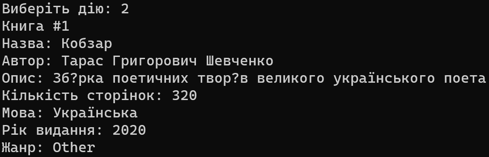
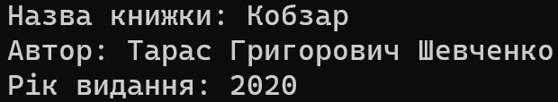
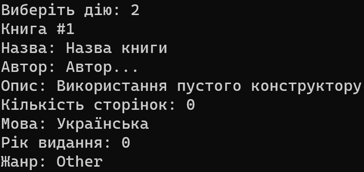

— [Завдання](#завдання)
— [Виконання](#виконання)
# 
 Лабораторна робота № 3

## 
 Тема: Конструктори, перевантаження (overloading) 

### Завдання:
На основі отриманого на лекції 3 теоретичного матеріалу скорегувати програму для лабораторної роботи № 2 наступним чином:
1. Додати до класу не менше трьох перевантажених конструкторів*.
 1.1 Один з конструкторів має бути без параметрів;
 1.2 Має бути реалізація хоча б одного конструктора через виклик іншого власного конструктора.
2. Для деякого public-методу класу додати його перевантажені версії.
 2.1  Пам’ятаємо про різну сигнатуру методів.
3. Структура меню залишається з лабораторної роботи № 2:
   1 — Додати об'єкт;
   2 — Вивести на екран об'єкти;
   3 — Знайти об'єкт;
   4 — Видалити об'єкт;
   5 — Демонстрація поведінки;
   0 — Вийти з програми.

___

### Виконання:
1. Створено перевантажені конструктори.
   Конструктор - це спеціальний метод класу, який має таку саму назву як і клас, і викликається при створенні об'єкту. Створімо основний об'єкт, який буде приймати всі параметри.
   Він виглядає так(тобто, потрібно заповнити всі поля):
   

   
Рисунок 1 — При використанні першого об'єкту, користувач повинен заповнити всі значення

   При створенні другого (вже перевантаженого конструктору), було використано менше параметрів, які потрібно вводити користувачу, можна сказати, що це мінімальний набір параметрів, який потрібен для заповнення інформації про книгу. Заповнюємо другий конструктор, все інше - дефолтні значення (тому що метод виведення використовується один, вирішив зробити так, а метод виведення виводить всі значення). Переглянути можна на рисунку 2.
   

    

    
    
Рисунок 2 — Створили другий об'єкт, який вже приймає менше параметрів, це означає, що користувач тепер повинен заповнити лише три поля, щоб додати книгу

    

    Перейдемо до останнього конструктора, який без параметрів (нажаль, нічого з ним не придумав, він пустий), але я для нього я теж створив об'єкт без параметрів, але в ньому такого сенсу немає, в моєму випадку, виводяться значення за замовчуванням. Переглянути можна на рисунку 3.
    
    

    
    
Рисунок 3 — Використання конструктора без параметрів дозволяє нам створити об'єкт без заповнення полів, він відразу додається, але виводяться в ньому дефолтні значення

    

